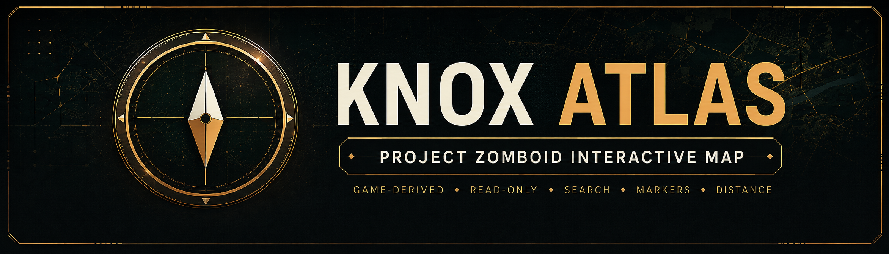
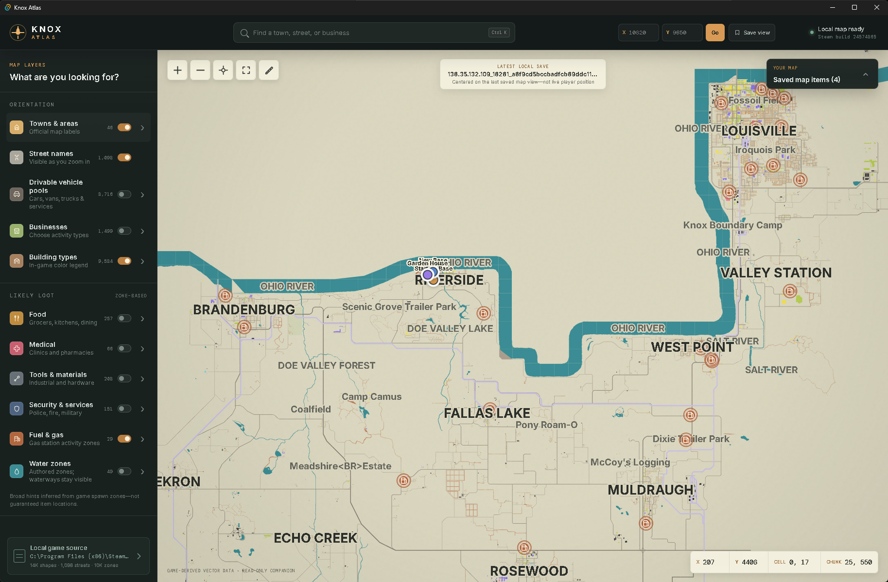
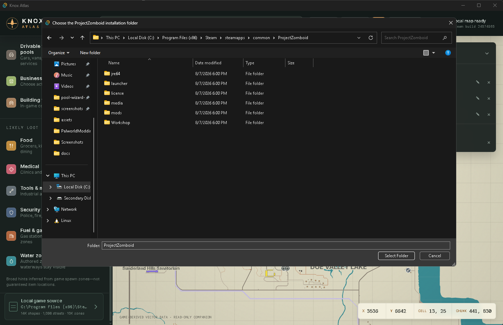
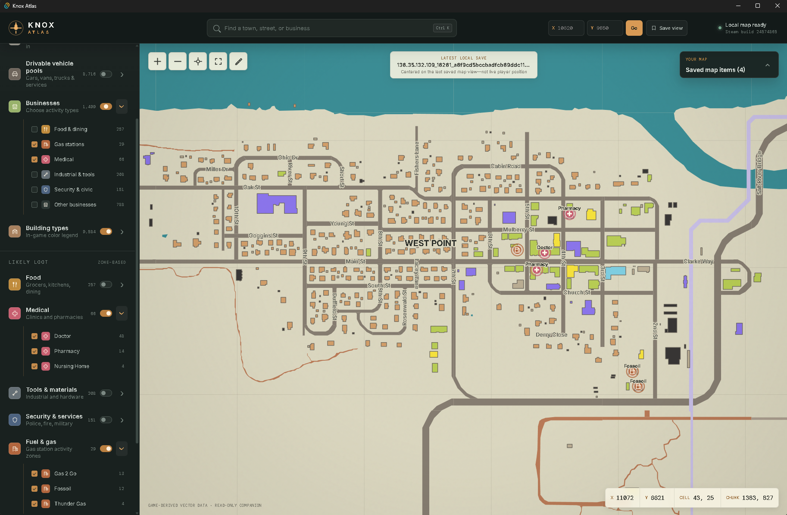
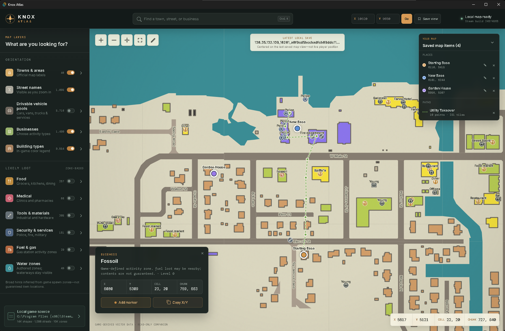
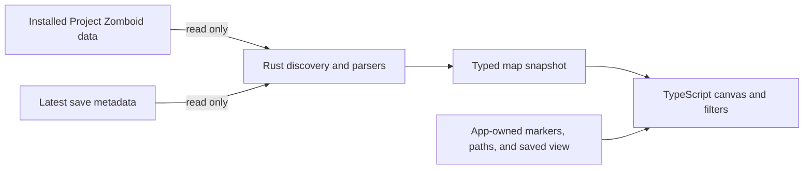

<p align="center">
  
</p>

<p align="center">
  <a href="https://github.com/TheMysticTurtle/Knox-Atlas/releases"></a>
  
  
  
</p>

<p align="center">
  
</p>

Knox Atlas is a **Project Zomboid interactive map** built from the vector map data installed with the
game. It can help you find towns, streets, businesses, likely resources, building types, vehicle
zones, and useful world coordinates.

**Knox Atlas is read-only.** It reads the game installation and limited save
metadata, but it never edits Project Zomboid or writes into a save.

---

## ✨ Features

- 🗺️ **Game-derived map** — water, terrain, roads, railways, building footprints, towns, landmarks,
  and street names come from the files installed with the game.
- 🔎 **Search and coordinate travel** — find towns, streets, landmarks, businesses, and activity
  zones, or jump directly to an X/Y coordinate.
- 🏪 **Expandable filters** — show only the businesses, building types, likely-loot categories, or
  vehicle pools you care about.
- 🎒 **Likely-loot hints** — food, medical, tools, security, fuel, and water layers are
  presented as game-authored zones rather than guaranteed live inventory.
- 🚙 **Drivable vehicle pools** — inspect possible car, van, truck, utility, and emergency spawn
  areas with game-defined pool context when available.
- 📍 **Personal markers** — save up to 100 named, colored markers locally and keep them visible over
  the map.
- 📏 **Distance measurement** — drop multiple points, see the combined straight-line distance, and
  save named, colored paths for later.
- 📂 **Selectable game source** — Steam libraries are discovered automatically, and the local source
  card can point Knox Atlas at another Project Zomboid installation folder.
- 🧭 **Map helpers** — copy stable clicked coordinates and bookmark a favorite center/zoom view.
- 🖥️ **Desktop companion UI** — can remain open on a second monitor or be checked while playing.

## ⬇️ Releases

Download the latest compiled Windows build from the
**[GitHub Releases page](https://github.com/TheMysticTurtle/Knox-Atlas/releases)**.

- **Installer — recommended:** download `Knox-Atlas-<version>-Windows-x64-setup.exe`, run it, and
  launch Knox Atlas from the normal Windows shortcuts.
- **Portable ZIP — optional:** unzip `Knox-Atlas-<version>-Windows-x64-portable.zip` into a writable
  folder and run `Knox-Atlas.exe`. Keep the included files together.

The portable package is a best-effort convenience. Tauri does not officially define a portable
distribution mode, and the portable executable expects the Microsoft WebView2 runtime to already be
installed on the machine. Download the runtime only from Microsoft's
[official WebView2 page](https://developer.microsoft.com/en-us/microsoft-edge/webview2/). The
[portable guide](docs/portable.md) includes Command Prompt and PowerShell checks, saved-item storage,
updates, removal, and backup notes.

### Vortex users

On Nexus Mods, use **Manual Download** and extract the portable ZIP normally. To keep Knox Atlas in
Vortex, open **Dashboard → Add Tool**, set **Target** to the extracted `Knox-Atlas.exe`, confirm
**Start In** is its folder, name it **Knox Atlas**, and save. Knox Atlas is a companion tool, so the
ZIP should not be deployed into Project Zomboid's game or Mods folder. See the complete
[Vortex guide](docs/vortex.md).

### 🛡️ Windows SmartScreen and antivirus

Knox Atlas is not currently code-signed. Windows SmartScreen or antivirus software may therefore
warn about an unfamiliar or unsigned application, especially immediately after a new release. That
is common for small independent projects.

The complete source used to build Knox Atlas is in this repository. Please feel free to inspect and compile the app yourself if you would rather not trust a
precompiled executable. (I don't blame ya) 

## 🚀 Running from a source checkout

The repository includes `Launch Knox Atlas.cmd` as a convenience for developers and curious users
who download the source. **It is not the installer and it is not needed by release users.** It is a
small, readable batch file that checks for Node/npm and Rust, installs missing frontend packages,
and starts the Tauri development app with live reload.

After cloning the repository or downloading its source archive, either double-click:

```text
Launch Knox Atlas.cmd
```

or run the equivalent commands yourself:

```powershell
npm install
npm run desktop:dev
```

You can open the `.cmd` file in any text editor before running it to verify its exact functions. 

## 🛠️ Building from source

### Requirements

- **Windows 10 or 11**
- **Node.js 22** with npm
- **Rust stable** using the MSVC toolchain
- **Microsoft C++ Build Tools** and
  **[WebView2](https://developer.microsoft.com/en-us/microsoft-edge/webview2/)**, as required by Tauri
  on Windows
- **Project Zomboid installed through Steam** to display the map when the finished app runs

Install the locked frontend dependencies once from the repository root:

```powershell
npm ci
```

### Build the NSIS installer

```powershell
npm run desktop:build
```

The finished setup executable is written beneath:

```text
src-tauri\target\release\bundle\nsis\
```

You can list the exact generated filename with:

```powershell
Get-ChildItem src-tauri\target\release\bundle\nsis\*.exe
```

### Build a portable ZIP

First build the standalone application executable without an installer bundle:

```powershell
npm run tauri -- build --no-bundle
```

Then package the executable with its portable notes:

```powershell
New-Item -ItemType Directory -Force -Path .release\portable
Copy-Item src-tauri\target\release\knox-atlas.exe .release\portable\Knox-Atlas.exe
Copy-Item packaging\PORTABLE-NOTES.txt .release\portable\README.txt
Copy-Item LICENSE .release\portable\LICENSE.txt
Compress-Archive -Path .release\portable\* -DestinationPath Knox-Atlas-0.1.1-Windows-x64-portable.zip -Force
```

The resulting ZIP can be moved to another Windows computer and extracted normally. WebView2 must
already be available on that computer. Follow [the portable guide](docs/portable.md) for runtime
checks and the separate per-user storage behavior.

### Verify a source build

```powershell
npm run check
cd src-tauri
cargo fmt --all -- --check
cargo test
```

## 🧭 Using the atlas

### **Choose the game installation**

Knox Atlas first checks the standard Steam installation and Steam's configured library folders. On
Windows, the usual default is:

```text
C:\Program Files (x86)\Steam\steamapps\common\ProjectZomboid
```

If Knox Atlas cannot find the game—or you want to use a different Steam installation—click the
**Local game source** card in the lower-left corner. In the folder picker, choose the
`ProjectZomboid` folder itself, then click **Select Folder**. A valid folder contains
`projectzomboid.jar` and the `media` directory. Knox Atlas validates the selection, remembers it in
its own local settings, and reloads the map from that installation.

<p align="center">
  
</p>

### **Explore and filter**

Pan and zoom around the game-derived canvas, search by name, and use the left-hand layer controls to
focus on the information you need. Parent filters can be expanded into individual categories—for
example, you can hide all businesses except gas stations.

<p align="center">
  
</p>

### **Work with coordinates**

The lower-right readout follows the pointer. Click a location to keep its X/Y, compiled-cell, and
chunk details stable, then copy the coordinate or save a marker there.

Choose **Measure distance**, then click each turn or waypoint in order. Knox Atlas totals the direct
tile distance of every segment. Undo points while drawing, or save the finished measurement as a
named, colored path in Knox Atlas's local storage. Measurements describe the lines you draw; they do
not calculate a road route.

### **Save your places**

Click a location and choose **Add marker** to give it a name and color. Markers live in Knox Atlas's
own local application storage, never in the Project Zomboid save. **Save view** remembers the current
center and zoom; the target map control returns to it later.

<p align="center">
  
</p>

Markers, saved paths, the preferred view, and the selected game installation persist automatically
under the current Windows account at `%LOCALAPPDATA%\com.pzcompanion.map`. Installer and portable
builds share that storage on the same account; the data is not kept beside the portable EXE. Moving
or updating the extracted program folder therefore does not normally remove it. Another computer or
Windows account starts separately, and built-in export/import is not available yet. The
[portable guide](docs/portable.md) explains the current best-effort backup procedure.

The **Local game source** card shows the installation currently being read. Click it to choose a
different `ProjectZomboid` folder if automatic Steam-library discovery does not find the right copy.

## 🗺️ Understanding the map layers

Knox Atlas distinguishes direct map data, inferred zones, and app-owned information.

| Layer | What it means |
| --- | --- |
| **Basemap, streets, and official labels** | Parsed directly from the installed game files. |
| **Building colors** | Game-authored display categories. `building=yes` is labeled **Unclassified buildings**. |
| **Businesses and likely loot** | Broad hints inferred from game-authored activity and loot zones; actual contents are not guaranteed. |
| **Water-zone count** | Explicit `WaterZone` records, not every riverbank, well, sink, or usable water tile. Waterways remain visible in the basemap. |
| **Vehicle pools** | Places where drivable vehicles may spawn, not confirmed live vehicles. |
| **Latest save location** | The last saved in-game map view used as a starting camera, not the player's live position. |
| **Custom markers** | Labels created by the user and stored locally by Knox Atlas. |
| **Saved paths** | User-drawn straight-line measurements stored locally by Knox Atlas. |

Random generation, sandbox settings, mods, player activity, and the current save determine what is
actually present in the world.

## 🧩 How it works



The Rust side owns file discovery and source-specific parsing. The TypeScript side owns map state,
prepared geometry, labels, filters, search, markers, and interaction. The boundary is intentionally
small, and the game installation and save directories remain read-only.

## 📚 Project documentation

- [**Architecture**](docs/architecture.md) — boundaries, data flow, renderer decisions, and design principles.
- [**Map data notes**](docs/map-data.md) — source files, coordinate systems, inference rules, and known limits.
- [**Detailed-map feasibility**](docs/detailed-map-feasibility.md) — what an interior/floor renderer would require.
- [**Roadmap and progress**](docs/roadmap.md) — the living backlog and implementation history.
- [**Development guide**](docs/development.md) — commands, branch conventions, checks, and maintainer notes.
- [**Windows distribution**](docs/distribution.md) — launcher, installer, portable build, and release workflow.
- [**Portable Windows guide**](docs/portable.md) — WebView2 checks, user-data persistence, updates, removal, and backup notes.
- [**Vortex and Nexus guide**](docs/vortex.md) — manual Nexus download and Vortex Dashboard tool setup.
- [**Changelog**](CHANGELOG.md) — versioned user-facing release history.
- [**Nexus Mods description**](docs/NEXUS-DESCRIPTION.bbcode) — ready-to-paste formatted listing copy.
- [**Nexus upload copy**](docs/NEXUS-UPLOAD-COPY.md) — short description and installer/portable file instructions.

## 🤝 Inspecting and feedback

Curious how a map source is interpreted? Please take a look. The source is documented and separated
into a read-only Rust adapter and a TypeScript renderer. Bug reports, source review, and reproducible
parser findings are welcome. Please open an issue before proposing changes or reuse.

When reporting a map mismatch, include the Project Zomboid Steam build number shown by Knox Atlas,
the approximate coordinates, and whether the location comes from the base map or a mod.

## 📄 License

Knox Atlas is source-available under the [PolyForm Strict License 1.0.0](LICENSE). It may be used for
permitted personal and noncommercial purposes. Redistribution and modified or derivative versions
are not permitted without written permission. You may inspect the source and build it for your own
permitted use. For collaboration or reuse inquiries, please open an issue.

## 🙏 Disclaimer

Knox Atlas is an unofficial community project. Project Zomboid and its game data are property of
The Indie Stone. This repository does not redistribute the game's map files; it reads them from the
user's own installation at runtime.
