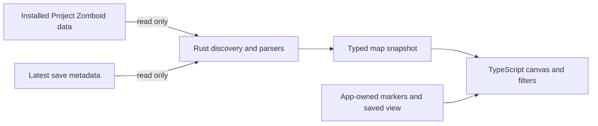

<h1 align="center">Knox Atlas</h1>

<p align="center"><strong>A friendly, read-only Project Zomboid interactive map and companion atlas.</strong></p>

<p align="center">
  <a href="https://github.com/TheMysticTurtle/Knox-Atlas/releases"></a>
  
  
</p>

<p align="center">
  
</p>

Knox Atlas is a fast, modern **Project Zomboid interactive map** built from the game data already
installed on your computer. Use it to find towns, streets, businesses, likely resources, building
types, vehicle zones, and useful world coordinates without installing a game mod or maintaining a
separate copy of Knox Country.

Most importantly, **Knox Atlas is read-only**. It reads the game installation and limited save
metadata, but it never edits Project Zomboid or writes into a save.

---

## ✨ Features

- 🗺️ **Game-derived map** — water, terrain, roads, railways, building footprints, towns, landmarks,
  and street names come from the files installed with the game.
- 🔎 **Search and coordinate travel** — find towns, streets, landmarks, businesses, and activity
  zones, or jump directly to an X/Y coordinate.
- 🏪 **Expandable filters** — show only the businesses, building types, likely-loot categories, or
  vehicle pools you care about.
- 🎒 **Honest loot hints** — food, medical, tools, security, fuel, and water layers are clearly
  presented as game-authored zones rather than guaranteed live inventory.
- 🚙 **Drivable vehicle pools** — inspect possible car, van, truck, utility, and emergency spawn
  areas with game-defined pool context when available.
- 📍 **Personal markers** — save up to 100 named, colored markers locally and keep them visible over
  the map.
- 🧭 **Simple navigation** — set a manual position and destination, see direct tile distance, copy
  stable coordinates, and bookmark a favorite center/zoom view.
- 🖥️ **Desktop companion UI** — designed for a second monitor or a quick alt-tab while playing.

## ⬇️ Releases

Download the latest compiled Windows build from the
**[GitHub Releases page](https://github.com/TheMysticTurtle/Knox-Atlas/releases)**.

- **Installer — recommended:** download `Knox-Atlas-<version>-Windows-x64-setup.exe`, run it, and
  launch Knox Atlas from the normal Windows shortcuts.
- **Portable ZIP — optional:** unzip `Knox-Atlas-<version>-Windows-x64-portable.zip` into a writable
  folder and run `Knox-Atlas.exe`. Keep the included files together.

The portable package is a best-effort convenience. Tauri does not officially define a portable
distribution mode, and the portable executable expects the Microsoft WebView2 runtime to already be
installed. The installer is the friendliest choice for most people.

### 🛡️ Windows SmartScreen and antivirus

Knox Atlas is not currently code-signed. Windows SmartScreen or antivirus software may therefore
warn about an unfamiliar or unsigned application, especially immediately after a new release. That
is common for small independent projects, but you should still download builds only from the
official Releases page.

The complete source used to build Knox Atlas is in this repository. You are warmly invited to read
it, inspect the release workflow, and build the app yourself if you would rather not trust a
precompiled executable. If a warning looks unusual or you are uncertain about a download, do not run
it until you are comfortable with its source.

## 🚀 Running from a source checkout

The repository includes `Launch Knox Atlas.cmd` as a convenience for developers and curious users
who download the source. **It is not the installer and it is not needed by release users.** It is a
small, readable batch file that checks for Node/npm and Rust, installs missing frontend packages,
and starts the Tauri development app with live reload.

After cloning the repository or downloading its source archive, either double-click:

```text
Launch Knox Atlas.cmd
```

or run the equivalent commands yourself:

```powershell
npm install
npm run desktop:dev
```

You can open the `.cmd` file in any text editor before running it; there is no hidden launcher
binary.

## 🛠️ Building from source

### Requirements

- **Windows 10 or 11**
- **Node.js 22** with npm
- **Rust stable** using the MSVC toolchain
- **Microsoft C++ Build Tools** and **WebView2**, as required by Tauri on Windows
- **Project Zomboid installed through Steam** to display the map when the finished app runs

Install the locked frontend dependencies once from the repository root:

```powershell
npm ci
```

### Build the NSIS installer

```powershell
npm run desktop:build
```

The finished setup executable is written beneath:

```text
src-tauri\target\release\bundle\nsis\
```

You can list the exact generated filename with:

```powershell
Get-ChildItem src-tauri\target\release\bundle\nsis\*.exe
```

### Build a portable ZIP

First build the standalone application executable without an installer bundle:

```powershell
npm run tauri -- build --no-bundle
```

Then package the executable with its portable notes:

```powershell
New-Item -ItemType Directory -Force -Path .release\portable
Copy-Item src-tauri\target\release\knox-atlas.exe .release\portable\Knox-Atlas.exe
Copy-Item packaging\PORTABLE-NOTES.txt .release\portable\README.txt
Compress-Archive -Path .release\portable\* -DestinationPath Knox-Atlas-0.1.0-Windows-x64-portable.zip -Force
```

The resulting ZIP can be moved to another Windows computer and extracted normally. WebView2 must
already be available on that computer.

### Verify a source build

```powershell
npm run check
cd src-tauri
cargo fmt --all -- --check
cargo test
```

Every pushed branch and pull request automatically runs the frontend check, Rust formatting check,
and Rust tests on GitHub Actions. The manual **Publish Windows release** workflow repeats those
checks before it performs the official Windows build, creates a reviewable draft release, and
attaches both installer and portable artifacts.

### Publish through GitHub Actions

1. Push the intended release commit and version tag to GitHub.
2. Open **Actions → Publish Windows release → Run workflow**.
3. Wait for the frontend check, Rust formatting check, Rust tests, and Windows packaging to finish.
4. Download and smoke-test the attached installer and portable ZIP from the generated draft.
5. Edit the release notes if desired, then publish the draft release.

## 🧭 Using the atlas

### **Explore and filter**

Pan and zoom around the game-derived canvas, search by name, and use the left-hand layer controls to
focus on the information you need. Parent filters can be expanded into individual categories—for
example, you can hide all businesses except gas stations.

### **Work with coordinates**

The lower-right readout follows the pointer. Click a location to keep its X/Y, compiled-cell, and
chunk details stable, then copy the coordinate or use it as your manual position or destination.

### **Save your places**

Click a location and choose **Add marker** to give it a name and color. Markers live in Knox Atlas's
own local application storage, never in the Project Zomboid save. **Save view** remembers the current
center and zoom; the target map control returns to it later.

## 🗺️ What the map is—and is not—telling you

Knox Atlas keeps source certainty visible instead of pretending every hint is live save data.

| Layer | What it means |
| --- | --- |
| **Basemap, streets, and official labels** | Parsed directly from the installed game files. |
| **Building colors** | Game-authored display categories. `building=yes` is shown honestly as **Unclassified buildings**. |
| **Businesses and likely loot** | Broad hints inferred from game-authored activity and loot zones; actual contents are not guaranteed. |
| **Water-zone count** | Explicit `WaterZone` records, not every riverbank, well, sink, or usable water tile. Waterways remain visible in the basemap. |
| **Vehicle pools** | Places where drivable vehicles may spawn, not confirmed live vehicles. |
| **Latest save location** | The last saved in-game map view used as a starting camera, not the player's live position. |
| **Custom markers** | Labels created by the user and stored locally by Knox Atlas. |

Random generation, sandbox settings, mods, player activity, and the current save determine what is
actually present in the world.

## 🧩 How it works



The Rust side owns file discovery and source-specific parsing. The TypeScript side owns map state,
prepared geometry, labels, filters, search, markers, and interaction. The boundary is intentionally
small, and the game installation and save directories remain read-only.

## 📌 Current scope

Knox Atlas `0.1.0` targets the base English map in common Steam library locations and reads its game
data once at startup. It does not yet:

- track the live player or other multiplayer players;
- identify randomized survivor houses or claimed safehouses from authoritative save data;
- show live container inventories, vehicle condition, or vehicle-key locations;
- discover every non-standard Steam library or enabled map mod;
- persist temporary route points or layer preferences.

Those limits are deliberate. A feature moves into the atlas only when its source and certainty can
be represented honestly.

## 📚 Project documentation

- [**Architecture**](docs/architecture.md) — boundaries, data flow, renderer decisions, and design principles.
- [**Map data notes**](docs/map-data.md) — source files, coordinate systems, inference rules, and known limits.
- [**Roadmap and progress**](docs/roadmap.md) — the living backlog and implementation history.
- [**Development guide**](docs/development.md) — commands, branch conventions, checks, and maintainer notes.
- [**Windows distribution**](docs/distribution.md) — launcher, installer, portable build, and release workflow.
- [**Changelog**](CHANGELOG.md) — versioned user-facing release history.
- [**Nexus Mods description**](docs/NEXUS-DESCRIPTION.bbcode) — ready-to-paste formatted listing copy.
- [**Nexus upload copy**](docs/NEXUS-UPLOAD-COPY.md) — short description and installer/portable file instructions.

## 🤝 Inspecting and contributing

Curious how a map source is interpreted? Please take a look. The source is intentionally kept small,
documented, and separated into a read-only Rust adapter and a straightforward TypeScript renderer.
Bug reports, source review, reproducible parser findings, and thoughtful contributions are welcome.

When reporting a map mismatch, include the Project Zomboid Steam build number shown by Knox Atlas,
the approximate coordinates, and whether the location comes from the base map or a mod.

## 🙏 Disclaimer

Knox Atlas is an unofficial community project. Project Zomboid and its game data are property of
The Indie Stone. This repository does not redistribute the game's map files; it reads them from the
user's own installation at runtime.
