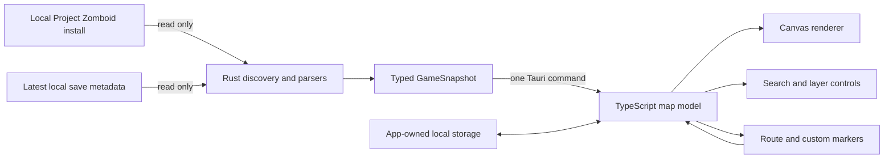

# Architecture

This document records the current design and the reasoning behind it. It should change when the design changes.

## System shape

There are three purposeful layers:

1. **Source adapter (Rust):** discovers local files, parses game-owned formats, normalizes names, and returns serializable data.
2. **Application model (TypeScript):** prepares reusable `Path2D` geometry, bounding boxes, search entries, and presentation state.
3. **View (HTML/CSS/canvas):** renders the map and handles filters, pan/zoom, selection, and manual markers.

No layer writes to the game install or save directory.

## Architectural decisions

### ADR-001: Native companion rather than an in-game mod

**Status:** accepted for the first release.

A Tauri desktop companion gives us local file access and a desktop interface without injecting code into Project Zomboid or requiring a server mod. The app can remain open next to the game and can later gain an optional, narrow integration for live position.

Tradeoff: exact live player state is not available in the read-only prototype.

### ADR-002: Installed game files are the map source of truth

**Status:** accepted.

Knox Atlas parses the map files already selected by the installed game. This avoids copying a large static basemap into the repository and reduces manual drift after game updates.

Tradeoff: upstream format changes can break a parser. We contain that risk in the Rust adapter and test against the installed game when available.

### ADR-003: One normalized snapshot crosses the Tauri boundary

**Status:** accepted.

The frontend calls `load_game_snapshot` once at startup. Rust returns plain typed data instead of exposing file paths or dozens of fine-grained commands. This keeps the security boundary small and makes renderer behavior deterministic.

Tradeoff: startup parses and serializes the full dataset. Add caching only if profiling shows this is a problem.

### ADR-004: Custom canvas instead of a geographic map library

**Status:** accepted.

Project Zomboid uses game-world X/Y coordinates, not longitude and latitude. The source is already local vector geometry, so a small canvas renderer avoids tile-server assumptions and an unnecessary map dependency.

The frontend precomputes `Path2D` objects and feature bounds once, culls off-screen geometry, coalesces redraws with `requestAnimationFrame`, and applies zoom thresholds to dense labels/zones.

Tradeoff: we own pan/zoom, label collision, and hit testing. Those behaviors are intentionally modest and covered by a small set of functions rather than an abstraction framework.

### ADR-005: Inference must be visible in the language and styling

**Status:** accepted.

Business/activity and spawn-zone metadata can suggest useful loot or possible vehicles, but it cannot prove current contents. The UI calls these layers “likely loot” and “vehicle zones,” includes a plain warning, and visually treats category selection as highlighting rather than inventory truth.

### ADR-006: User state stays separate from game state

**Status:** accepted.

Named custom markers, their palette keys, and one saved camera position/zoom are stored as small, versioned JSON records in the desktop WebView's app-owned local storage. Marker records are validated and capped at 100 when loaded; older records without a color safely default to amber. Manual position and destination remain session-only because they describe temporary navigation state.

Knox Atlas never writes markers into a Project Zomboid save. A future move to a settings file or database should preserve that boundary and include an explicit migration from the versioned browser-storage key.

## Runtime boundaries

### Rust owns

- Steam-install discovery.
- Save-directory discovery.
- XML/Lua-shaped text/JSON parsing.
- Source-specific coordinate normalization.
- Readable labels and broad zone categories.
- Read errors and source warnings.

### TypeScript owns

- View center and zoom.
- Layer/filter state.
- Prepared render geometry and viewport culling.
- Label collision and density thresholds.
- Search index and selection.
- Session route markers, persisted custom markers, and direct distance.

### CSS owns

- Layout and responsive panel behavior.
- Visual hierarchy, focus states, motion preferences, and map chrome.
- Category colors shown by the controls; canvas colors are mirrored in TypeScript because the canvas API cannot consume CSS variables reliably.

## Dependency policy

Keep dependencies boring and justified.

- Tauri provides the desktop shell and narrow IPC boundary.
- `quick-xml` streams the map XML without building a large DOM.
- `regex` handles the stable, limited records needed from Lua-shaped data and annotation calls.
- The frontend uses browser APIs directly; it does not currently need a UI framework or map library.

Before adding a dependency, record what maintained code it replaces and whether the runtime cost is appropriate.

## Failure behavior

- Missing game install: show a readable error and leave the game untouched.
- Missing save: open the map using map metadata and warn that no save was found.
- Missing optional labels or metadata: prefer a partial useful map where the parser can safely continue.
- Changed required map format: fail at the adapter boundary with a source-specific message.
- Unavailable or malformed app-owned marker storage: ignore invalid records and keep the map usable.

## Next architectural seam

Live position should be an optional provider behind a small interface, not folded into map parsing. Candidate providers are:

1. Manual position entry (current, zero integration).
2. App-owned polling of a deliberately exported position file from a tiny client mod.
3. Server-authorized multiplayer position feed.

Options 2 and 3 require explicit consent and separate threat/privacy design. Reading arbitrary process memory is out of scope.

## References

- [Tauri frontend-independent architecture](https://v2.tauri.app/start/frontend/)
- [Tauri command model](https://v2.tauri.app/develop/calling-rust/)
- Primary map-format evidence: the files in the user's installed `ProjectZomboid/media/maps` directory and the game's own `ISMapDefinitions.lua`.
