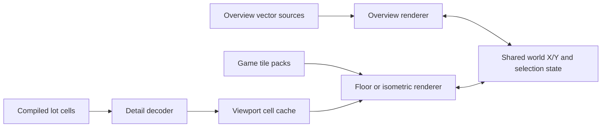

# Detailed map and floor-level feasibility

This note records the initial investigation into showing the detailed in-game world, including building interiors and selectable floors. It is a future feature study, not part of the `0.1.1` scope.

## Short answer

It is feasible, but the installed game does not provide a ready-made set of detailed floor images for Knox Atlas to display. We would need to decode the compiled tile map and build a separate detailed renderer. That is a meaningfully larger project than the current vector overview.

A floor-plan-style renderer is the sensible first step. Reproducing the game's textured isometric view exactly would be a later, substantially larger step.

## Evidence in the installed game

The inspected Build 42 installation contains detailed compiled world data alongside the overview sources:

- 4,065 `.lotheader` files.
- 4,065 `.lotpack` files totaling about 3.8 GB.
- 4,067 `.bin` files.
- Texture packs, depth maps, geometry textures, light maps, and shaders used by the game renderer.
- A 117 MB `worldmap.png` and vector/pyramid overview assets, which are not an interior/floor dataset.

The official mapping workflow separates a 300 × 300-tile world cell from its detailed tile layers, buildings, rooms, furniture, and generated lot files. Floors use numbered layer prefixes such as `0_` for ground level and `1_` for the next level. The mapping guide also describes generating `.lotpack`, `.lotheader`, and `.bin` files for the game.

References:

- [The Indie Stone: One Stop TileZed Mapping Shop](https://theindiestone.com/forums/topic/21951-the-one-stop-tilezed-mapping-shop/)
- [The Indie Stone: floor layer naming in TileZed/WorldEd](https://theindiestone.com/forums/topic/46655-cant-for-the-life-of-me-figure-out-how-to-add-levels-in-tilezed-or-make-tiles-appear-in-worlded/)

## Three possible levels of detail

### 1. Top-down floor plan — recommended first milestone

Decode visible tiles, rooms, walls, doors, stairs, and major furniture for one viewport and one Z level. Render simplified shapes and symbols using Knox Atlas's own palette.

This would provide the practical value—interiors and floor selection—without first reproducing the whole game renderer. It is still a medium-to-large feature because the compiled lot format, mod layering, and Build 42 changes must be handled correctly.

### 2. Textured isometric atlas

Decode the same cell data, resolve every tile name to its texture-pack sprite, and draw tiles in isometric depth order. Add roof/wall cutaways, multi-tile objects, stairs, vegetation, and floor controls.

This would look closer to the game, but it requires a tile-asset loader and a renderer with many of the game's ordering rules. It should be treated as its own renderer, not squeezed into the current overview canvas.

### 3. Capture the game's live rendered view

This would require instrumenting or capturing the running game. It conflicts with the current read-only, low-integration design and would be fragile around camera state, occlusion, saves, multiplayer, and updates. It is not recommended.

## Recommended architecture

Keep the current vector overview as the default and add a separate detail provider behind the existing world-coordinate model:

Important boundaries:

- Decode only cells near the current viewport; never load the multi-gigabyte world at once.
- Cache decoded cells by map source, game build, cell coordinate, and format version.
- Keep a Z-level selector in view state.
- Resolve base-game and mod map order before rendering a cell.
- Keep all reads inside the Rust adapter and return normalized tile/room records to the frontend.
- Treat texture extraction and caching as derived local data; never redistribute Project Zomboid assets.

## Suggested research spike

Before committing to the feature, decode one known cell and answer four questions:

1. Can floors, walls, doors, stairs, rooms, and furniture be recovered reliably from the installed Build 42 lot files?
2. Can the tile identifiers be mapped to installed texture-pack sprites without copying game assets into the project?
3. How long does one cell take to decode, and how much memory does its normalized representation require?
4. How do base-map cells and enabled map mods override or compose with one another?

If that spike succeeds, build the top-down floor-plan view first. Exact textured isometric rendering should remain a separate later milestone.
